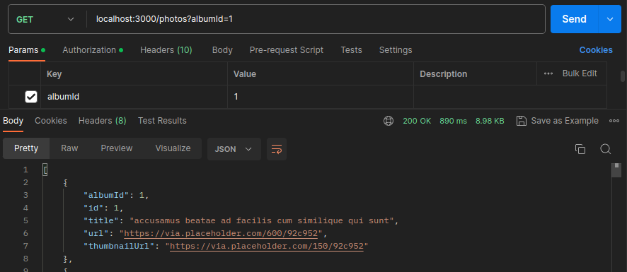
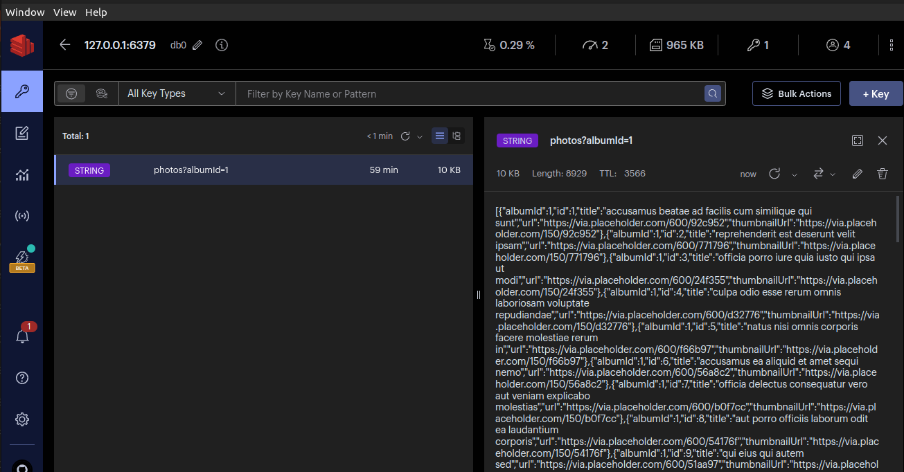
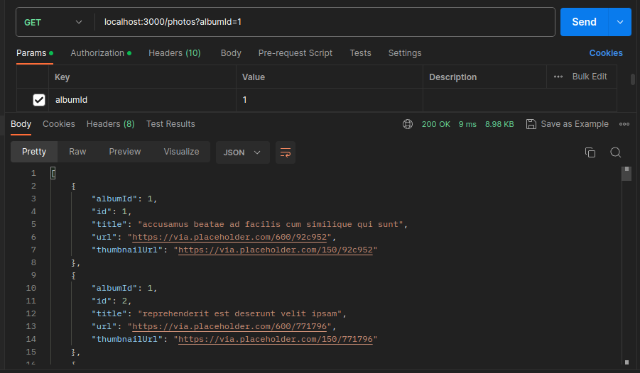

# Running

- node server.js
- akses `localhost:3000/photos` di REST CLIENT (Postman, Insomnia)
- Lihat sebelum menggunakan redis, `Time: 890 ms`
  
- Disini kita menggunakan RedisInsight untuk cek masuk atau tidak datanya:
  
  Lihat sudah masuk
- Ketika kita hit kembali APInya, Lihat sekarang, `Time: 9 ms`
  
  Sangat cepat.

Penggunaan redis sebagai cache biasanya digunakan ketika menggunakan API pihak ketiga,
Hal ini dilakukan untuk mengurangi hit API ke pihak ketiga serta ketika API pihak ketiga
sedang lambat. Kita tidak terpengaruh oleh itu. Catatan hati-hati dalam penggunaan cache
pastikan datanya sesuai jangan terdapat miss.
